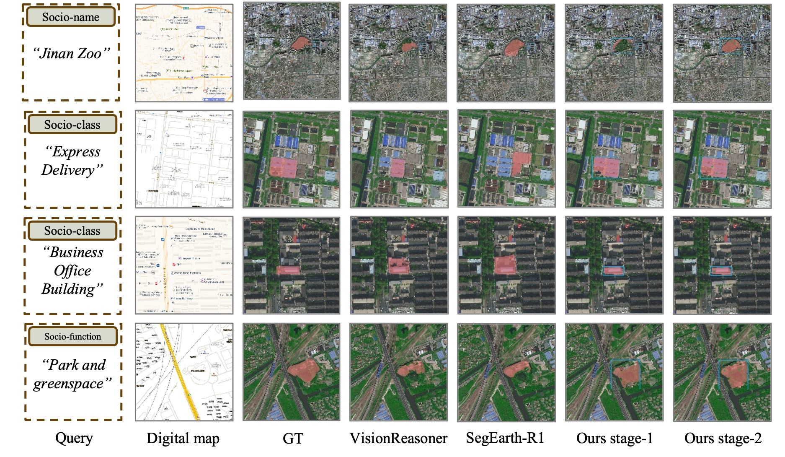

# SocioSeg
[]()

Official implementation of Urban Socio-Semantic Segmentation with Vision-Language Reasoning.


**Abstract:** This paper introduces the Urban Socio-Semantic Segmentation dataset named SocioSeg, a new resource comprising satellite imagery, digital maps, and pixel-level labels of social semantic entities organized in a hierarchical structure. Additionally, we propose a novel vision-language reasoning framework called SocioReasoner that simulates the human process of identifying and annotating social semantic entities via cross-modal recognition and multi-stage reasoning. We employ reinforcement learning to optimize this non-differentiable process and elicit the reasoning capabilities of the vision-language model. Experiments demonstrate our approach's significant gains over state-of-the-art models and strong zero-shot generalization.

- [x] Code: Available in this repository.
- [ ] Dataset and Model: Undergoing review (Link coming soon).


## 1. Installation
- OS: Linux distribution support for CUDA
- Hardware: At least 4x NVIDIA H20 (or A100 80GB) GPUs
- Framework: This repository is based on [ROLL](https://github.com/alibaba/ROLL), following the below installation instructions.
```bash
conda create -n socioseg python=3.10 -y
conda activate socioseg
pip install torch==2.6.0 torchvision==0.21.0 torchaudio==2.6.0
pip install -r requirements.txt
pip install flash-attn==2.7.4.post1 --no-build-isolation --no-cache-dir
pip install 'transformer-engine[pytorch]==2.2.0' deepspeed==0.16.4 vllm==0.8.4 --no-build-isolation
pip install -e .
```

## 2. Training, Evaluation and Visualization

Please download the dataset and change the `actor_train.data_args.file_name` and `validation.data_args.file_name` in [examples/train/rlvr_megatron.yaml](examples/train/rlvr_megatron.yaml)
```bash
sh examples/train/train.sh
```

Please download the dataset & pretrained model(or the model trained by yourself), and change the `actor_train.data_args.file_name` and `pretrain` in [examples/infer/rlvr_megatron.yaml](examples/infer/rlvr_megatron.yaml)
```bash
sh examples/infer/infer.sh
```
The evaluation and visualization results will be saved in `./output/infer/result/`



## Acknowledgements
We thank the authors of [ROLL](https://github.com/alibaba/ROLL) and [SegZero](https://github.com/JIA-Lab-research/Seg-Zero).